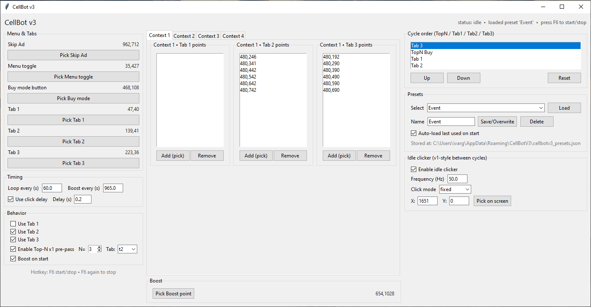
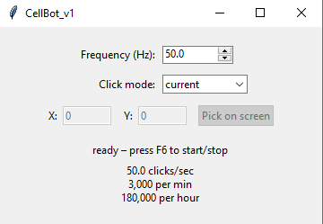
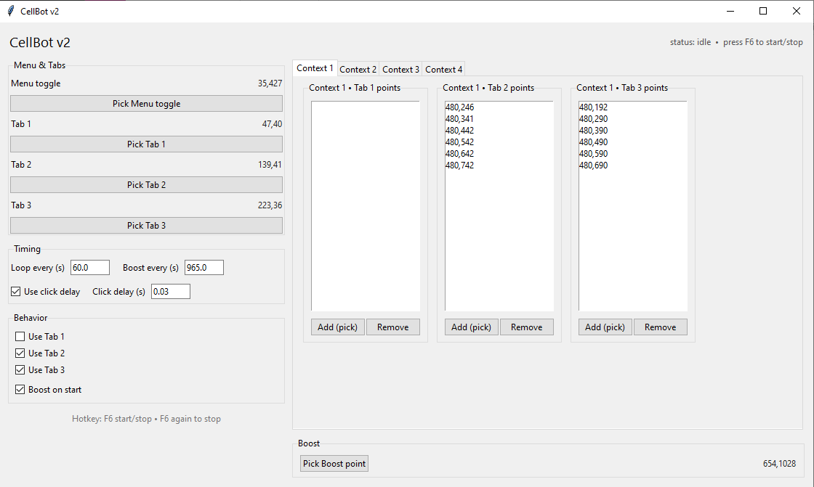

# CellBot

Tre varianter av en auto-clicker / cyklisk bottare byggd i Python.  
Alla tre startas/stoppas med **F6** och använder Tkinter för GUI.



---

## CellBot v1
En enkel auto-clicker med två lägen:
- **Current cursor position** – klickar där musen är.
- **Fixed position** – klickar på en vald X/Y-koordinat (manuellt eller genom att picka på skärmen).

Inställningar:
- Frekvens (Hz)
- Lägesval (current/fixed)
- Pick på skärm för koordinater

Extra:
- Nödstopp genom att dra musen till övre vänstra hörnet (<5px).



---

## CellBot v2
En mer avancerad cyklisk bot som kör sekvenser:
1. Menu Toggle  
2. (Valfritt) Tab 1  
3. (Valfritt) Tab 2  
4. (Valfritt) Tab 3  
5. Boost (om det är dags)

Inställningar:
- Loopintervall (sek)  
- Boostintervall (sek)  
- Per-kontext klickpunkter (Context 1–4)  
- Togglar för vilka tabs som används  
- Click delay mellan klick  



---

## CellBot v3
Kombinerar v1 och v2:
- Kör **cykeln från v2** enligt schema.  
- Mellan cyklerna körs **idle-klickaren från v1** (med frekvens, current/fixed mode och pick-funktion).  

Perfekt om du vill ha både en cyklisk sekvens och kontinuerliga klick däremellan.

---

## Bygga till .exe
Bottarna kan packas med [PyInstaller](https://pyinstaller.org/).  
Exempel för v3:

```powershell
pyinstaller --noconsole --onefile cellbotv3.py
